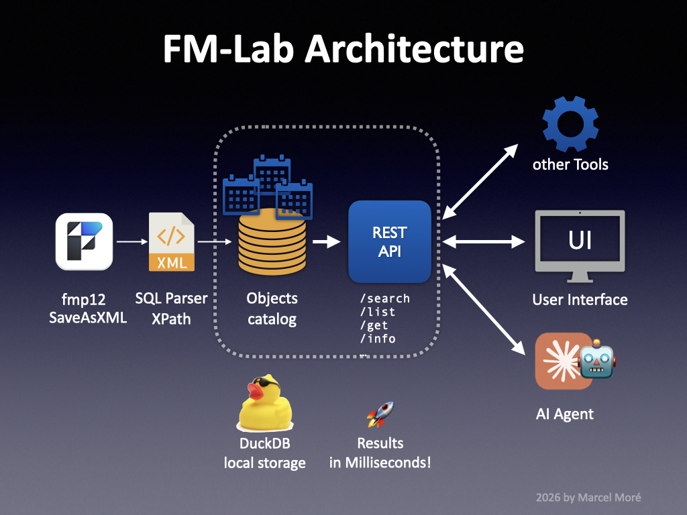

# fm-lab-windows-codex - FileMaker Code Analyzing Foundation

A Windows/Codex fork of **fm-lab**, the **DuckDB**-based tool for analyzing
**FileMaker SaXML exports**. Converts the XML structure of a FileMaker solution
into a queryable DuckDB database — covering all object types and their
dependencies — for fast cross-reference analysis.


## Prolog

FileMaker development is facing a new paradigm: **code must be readable and understandable by both humans and AI agents**. While every other major programming environment has a well-established ecosystem for code analysis, documentation, and refactoring, FileMaker's proprietary format makes it hard to participate in that ecosystem — there is no native API to query a solution's structure programmatically. Numerous tools try to bridge this gap, but often lack depth or scalability. Some serve human developer workflows well; others target AI integration but rely on repetitive, fragile setups. Most are closed source, which limits their adaptability in a rapidly evolving landscape.

This project takes a different approach. It converts the full structure of a FileMaker solution — exported as SaXML — into a queryable DuckDB database. All object types (scripts, fields, layouts, relationships, value lists, and more) land in dedicated tables, with **a universal catalog that links objects and their dependencies across the entire solution**. DuckDB's in-process engine makes this catalog fast enough for both interactive queries and **AI-driven analysis at scale**, without any database server setup. A REST API and a web client provide additional access layers for GUI and integration workflows.

The first release focuses on this core: reliable XML conversion, a comprehensive object catalog, and a modular architecture that is open source and **easy to extend**. Future releases will build on this foundation — the long-term goal is to become a solid developer tooling platform for the FileMaker space.

**Addendum:** [Claris has announced native support for AI coding within FileMaker](https://www.claris.com/blog/2026/how-claris-is-building-for-what-comes-next) for the upcoming releases. This does not contradict the goals of this project, but rather emphasizes the need for a solid foundation for code analysis and tooling in the FileMaker ecosystem. The architecture of fm-lab is designed to be flexible and adaptable, so it can integrate with Claris's AI coding features as they evolve, while also providing value to developers who want to leverage AI tools in their workflows today.


## Features

- **XML Ingestion pipeline** — for FileMaker XML exports into DuckDB based on a flexible SQL template system, designed for easy maintenance and updates as FileMaker evolves ♻️
- **Detailed Object Catalog** — 30 tables covering all FileMaker object types, with a universal catalog linking objects and their dependencies for fast cross-reference queries 🔗
- **Detailed Reference Catalog** — optional localized tables for FileMaker ScriptSteps and Functions, providing reference queries and inline help-docs when a local reference DB is installed 📄
- **DuckDB Backend** — In-process analytical database engine for fast and flexible queries without server setup, delivers results in milliseconds even for large solutions 🚀
- **REST API** — Express server providing HTTP access to the analysis database, enabling integration with external tools and services 🧩
- **Web Client** — React/Vite frontend for interactive exploration of the solution's structure and dependencies with rich visualizations 🔎
- **Agent Workflows** — Codex/Windows orchestration via PowerShell plus the original Claude Skills for upstream compatibility 🤖
- **Database-aware AI Chat** — optional OpenAI-compatible chat layer with saved conversations, Markdown export, and provider hooks for Claude/Anthropic and Ollama 💬
- **FileMaker Server log analysis** — optional import for `TopCallStats.log`, matching slow server calls to fields/layouts and surfacing optimization hints 📈
- **Comprehensive Docs** — Easy-to-install documentation of FileMaker Pro and MBS plugin functions 📚
- **Plugin System** — Open architecture for adding new tools and integrations, starting with **[fmIDE](https://github.com/fmIDE/fmIDE)** as a first-class citizen to provide direct navigation into FileMaker's Script Workspace 🛠️
- **Prepared for AI code generation** — The architecture and data model are designed to support AI-driven code generation, augmented by reliable context from the object catalog and the integrated docs 🧠


## Architecture



```
SaveAsXML → Parser → DuckDB → REST API ←→ Tools
                                       ←→ UI
                                       ←→ AI Agent
```


## Components

- **XML Export** (`xml/` by default, or a custom folder via `FM_LAB_XML_DIR`) — prepared FileMaker XML exports (SaXML) for conversion from your solution; productive exports should usually live outside Git
- **SQL Templates** (`sql/`) — Conversion templates and universal catalogs
- **DuckDB Catalog** (`db/`) — the resulting DuckDB database with all FileMaker objects and their relationships
- **REST API** (`rest-api/`) — Express server for HTTP access to the analysis database
- **Web Client** (`apps/web/`) — React/Vite frontend
- **Scripts** (`scripts/`) — Utility scripts for various tasks
- **Docs** (`docs/`) — Documentation files for FileMaker Pro and MBS plugin functions, installable via Claude Skills
- **Codex Instructions** (`AGENTS.md`) — project rules and Windows-first commands for Codex
- **Claude Skills** (`.claude/skills/`) — legacy/upstream slash commands for conversion, analysis, and documentation installation
- **Plugin registry** (`.fmlab/`) — registry and prefs for fm-lab plugins


## Compatibility

This fork adds a **Windows/Codex** workflow while keeping the original **macOS/Linux** Bash scripts available.

On Windows, use the PowerShell scripts in `tools/*.ps1`. They replace the bash-only orchestration dependencies (`lsof`, `nohup`, `file`, `iconv`, `tr`, `sed`, `md5sum`) with PowerShell and .NET APIs.

All base technologies (DuckDB, Node.js, Express, React) are cross-platform, so the main work for Windows compatibility will be in adapting the shell scripts and ensuring any file path handling is robust across OSes.

FileMaker XML exports are supported on all platforms where FileMaker Pro is available. The conversion process relies on the structure of the **SaXML** export from **FileMaker Versions 19 and above**. Future updates of FileMaker may require adjustments to the XML parsing.


## Prerequisites for the Analysis Tool (Standalone via GUI or REST API)

- [DuckDB CLI](https://duckdb.org/docs/installation/) ≥ 1.0
- Node.js ≥ 18, npm ≥ 9
- FileMaker Pro (for the SaXML export, SaXML v2.1.0.0+ / FileMaker 19+)

## Prerequisites for Analysis with Codex on Windows

- PowerShell 5.1+ or PowerShell 7+
- FileMaker Pro for creating the SaXML export
- Node.js LTS and [DuckDB CLI](https://duckdb.org/docs/installation/) for runtime/import

The recommended Windows entry point checks these runtime dependencies. If
Node.js or DuckDB is missing, it offers installation via `winget` where
available, otherwise it prints the exact manual install hint. No global project
configuration is required.

Manual install hints:

```powershell
winget install OpenJS.NodeJS.LTS
winget install --id DuckDB.cli --exact --source winget
scoop install duckdb
choco install duckdb
```

The original Claude Code workflow remains in `.claude/skills/`, but the Windows/Codex path does not require Claude Code or `.claude/settings.json`.

## Preparing the XML Export

Export your FileMaker solution as XML via `Tools > Save a Copy As XML` (SaXML) in FileMaker Pro. This export contains the full structure of your solution, including scripts, fields, layouts, relationships, value lists, and more — all of which will be parsed and stored in the DuckDB catalog for analysis by FM-Lab. Repeat this for every file of your solution (e.g. if you have multiple files in a multi-file solution). The XML export is the core input for FM-Lab, so it's important to ensure that it is up to date with your current solution structure.

You may want to automate this export process with a script using [Script step: Save a Copy as XML](https://help.claris.com/en/pro-help/content/save-a-copy-as-xml.html) for every file of your solution.

**Important:** Make sure to activate the option "Include details for analysis tools" when saving the XML export, this includes valuable metadata for analysis.

## Setup

```bash
# Clone the repository
git clone https://github.com/marcel-more/fm-lab.git fm-lab-windows-codex
cd fm-lab-windows-codex
```

The repository ships with a small neutral `xml/Kontakte.xml` example so a fresh
clone can be started immediately. To analyze your own FileMaker file, place the
exported XML in `xml/`, or set
`FM_LAB_XML_DIR` to an external local data folder:

```powershell
$env:FM_LAB_XML_DIR = "C:\Path\To\FileMakerXml"
```

For large or productive exports, use an external folder via `FM_LAB_XML_DIR` so
XML files stay out of Git. The `.gitignore` keeps user XML exports ignored and
only allows the bundled `xml/Kontakte.xml` example.

On Windows, XML files larger than 1 GB are automatically processed in temporary
blocks before DuckDB reads them. For very large files, `LayoutCatalog` and
`StepsForScripts` are first streamed with .NET `XmlReader` into CSV staging
files and then loaded into DuckDB tables. This avoids the high-memory DuckDB
XPath path for large layouts and the slow XPath path for large script-step
catalogs. The remaining catalogs are split into smaller `part001`, `part002`,
... segment files with a 32 MB target size and imported sequentially. The
targets can be overridden with `FM_LAB_XML_SEGMENT_MB` and
`FM_LAB_XML_SEGMENT_ITEMS`; set `FM_LAB_STREAM_LAYOUTS=0` or
`FM_LAB_STREAM_STEPS=0` only for diagnostics.

After the universal catalogs are built, the importer also runs
`sql/create_table_occurrence_usage_analysis.sql`. This materializes
`TableOccurrenceUsageSummary`, `TableOccurrenceUsageDetails`, and
`TableOccurrenceRelationshipDetails` so the REST API and web client can list
table occurrence usage and unused TOs without running expensive live formula
scans on every request. It also runs `sql/create_object_usage_analysis.sql`,
which materializes `ObjectUsageSummary` and `ObjectUsageDetails` for unused or
rarely referenced scripts, layouts, custom functions, value lists, fields, and
base tables.

### Windows/Codex quick start

```powershell
powershell -NoProfile -ExecutionPolicy Bypass -File .\Start-FileMaker-Object-Browser.ps1
```

For double-click use on Windows, start:

```text
Start-FileMaker-Object-Browser.cmd
```

This is the preferred one-file Windows start after cloning the repository. It:

- checks Node.js and npm, and offers `winget` installation if they are missing
- runs `npm install` automatically when dependencies are not installed yet
- rebuilds the shared package when the generated runtime output is missing or stale
- asks which XML file from `xml/` should be imported
- offers the bundled `Kontakte.xml` example when `xml/` is empty
- uses a separate small DuckDB database for a single selected XML file, such as `fm_kontakte.duckdb` or `fm_contacts.duckdb`
- lets you choose an existing DuckDB database when you skip the import
- finds DuckDB in common Windows locations, or offers `winget install DuckDB.cli`
- remembers a manually selected DuckDB path in local, ignored settings
- restarts an already running local REST API when needed so the selected database is actually used
- starts the REST API and web client
- opens `http://localhost:5173`

Local runtime files such as XML exports, FileMaker files, DuckDB databases,
logs, `node_modules`, and `.fmlab/local-settings.json` are ignored by Git.

### macOS/Linux legacy setup

```bash
bash tools/init.sh
```

`init.sh` provides the original Bash-based setup for macOS/Linux.

## Day-to-day

Start the Windows/Codex fork with the root-level PowerShell file:

Windows/Codex:

```powershell
powershell -NoProfile -ExecutionPolicy Bypass -File .\Start-FileMaker-Object-Browser.ps1
```

Useful non-interactive variants:

```powershell
.\Start-FileMaker-Object-Browser.ps1 --xml Kontakte.xml --start-website --codex
.\Start-FileMaker-Object-Browser.ps1 --skip-import --start-website --claude
.\Start-FileMaker-Object-Browser.ps1 --skip-import --no-start-website
```

Stop them with:

```powershell
powershell -NoProfile -ExecutionPolicy Bypass -File .\tools\stop-servers.ps1
```

macOS/Linux legacy:

```bash
bash tools/start-servers.sh
```

### Manual start (power users)

For custom setups — e.g. running the REST API as a standalone service:

```bash
# REST API (port 3003)
cd rest-api
cp .env.example .env   # adjust ports if needed
npm run dev

# Web Client (port 5173)
cd apps/web
cp .env.example .env   # adjust VITE_API_URL if API runs on a different port
npm run dev
```

### AI chat setup

The web client includes an optional `AI-Chat` tab. It stores conversations as
JSON under `rest-api/data/ai-chats` and can export each conversation as
Markdown. API keys are entered in the web client's Settings view and stored only
in the current browser, not in `.env`, DuckDB, chat JSON, or Markdown exports.
The key is sent to the local REST API only for the active chat request.

The DuckDB catalog remains read-only; the REST API builds a compact, sanitized
context from ObjectCatalog, quality findings, TO usage, API summaries, and
matching script steps before calling the selected provider.

Saved conversations are bounded by operational limits so the local JSON store
does not grow without control:

```bash
AI_CHAT_RETENTION_DAYS=30
AI_CHAT_MAX_CONVERSATIONS=200
AI_CHAT_MAX_MESSAGES=60
AI_CHAT_MAX_FILE_BYTES=1048576
```

For OpenAI-compatible models, the server-side defaults are:

```bash
AI_PROVIDER=openai
OPENAI_MODEL=gpt-4.1-mini
```

The provider registry also contains placeholders for Anthropic/Claude and
Ollama. Add or change models through `ANTHROPIC_*` and `OLLAMA_*` environment
variables; no frontend change is needed for additional providers that implement
the same registry interface.

### Quality checks

Before handing over a change, run:

```powershell
npm run lint
npm run test
npm run build:shared
npm run build --workspace=web
npm audit --omit=dev --audit-level=high
npm run test:xml
```

The REST API test suite covers the main smoke endpoints and validation behavior.
The web test suite covers plugin HTML sanitizing against allowed markup and XSS
payloads. `npm run test:xml` imports the small `xml-test/` fixture into
`db/fm_test.duckdb` as a fast converter smoke test.

To open the bundled Kontakte example in the normal XML input folder:

```powershell
npm run sample:xml
```

This prepares `xml/Kontakte.xml` from `xml-test/Kontakte.xml` and opens the
`xml/` folder in Windows Explorer. Add `-- --import` to import it into the
normal `db/fm_catalog.duckdb` catalog:

```powershell
npm run sample:xml -- --import
```

When starting the local servers, the Windows helper asks whether Codex/OpenAI,
Claude/Anthropic, or Ollama should be the default AI provider for that API
process. You can also make the choice non-interactively:

```powershell
.\Start-FileMaker-Object-Browser.ps1
npm run start:win -- --codex
npm run start:win -- --claude
```

The root-level `Start-FileMaker-Object-Browser.ps1` is the recommended Windows
entry point. It asks which XML file to import, can remember a local DuckDB CLI
path in `.fmlab/local-settings.json`, and then starts the REST API plus web UI.

### API logging

Runtime logs use the dependency-free `rest-api/src/utils/app-logger.js` helper.
Use `LOG_LEVEL=error|warn|info|debug` and `LOG_FORMAT=text|json` to control the
server output. SQL and stack debug details remain gated by
`ALLOW_DEBUG_OUTPUT=1` outside production.

### Frontend structure

`apps/web/src/App.tsx` is the router shell. The dashboard/search workflow lives
in `apps/web/src/views/SearchView.tsx`, route-heavy detail views are lazy-loaded,
and UI language helpers are centralized in `apps/web/src/lib/uiLanguage.ts`.
The Vite build keeps graph-heavy dependencies in a separate `vendor-graph`
chunk so the normal dashboard/search startup path does not pay that cost.

### FileMaker Server log import

The `Server-Logs` tab can analyze copied FileMaker Server `TopCallStats.log`
files. Copy or download the server log folder first; do not import directly from
a live server log directory while FileMaker Server is writing to it.

```powershell
powershell -NoProfile -ExecutionPolicy Bypass -File .\tools\import_server_logs.ps1 -LogDir C:\Path\To\Copied\Logs
```

or:

```powershell
npm run import:server-logs -- -LogDir C:\Path\To\Copied\Logs
```

The import creates `ServerTopCallLogRaw`, `ServerTopCallObjectMatches`,
`ServerTopCallOptimizationSummary`, and `ServerTopCallDashboard`. Top-call
targets in the documented forms `<filename>::<tableID>::<fieldID>` and
`<filename>::<layout>` are matched against `FieldsForTables` and `Layouts`.
Script attribution is not always available in TopCallStats alone; combine it
with Script Event logs in a later extension when precise script matching is
needed.

### Best-practice package import

Curated FileMaker best-practice knowledge can be imported from a single ZIP
package. The package must contain `manifest.json`,
`data/fm_lab_knowledge_cards.jsonl`, optional source rows, and optional
Markdown docs.

```powershell
npm run import:best-practice -- -ZipPath C:\Path\To\fm-lab-best-practice-kanon-2026-05-16-v1.zip
```

The import creates `BestPracticePackages`, `BestPracticeKnowledgeCards`,
`BestPracticeKnowledgeSources`, `BestPracticeDocuments`, and the query views
`BestPracticeKnowledgeCardsCurrent` and `BestPracticeOptimizationTips`.

## Further Documentation

- [`CLAUDE.md`](CLAUDE.md) — in-depth technical documentation on tables, columns, and query patterns
- [`AGENTS.md`](AGENTS.md) — Codex/Windows project instructions
- [`docs/windows-codex.md`](docs/windows-codex.md) — Windows setup and operations guide
- [`CHANGELOG.md`](CHANGELOG.md) — release history

## Optional Reference Data

The REST API can attach an optional local FileMaker reference database at
`rest-api/db/fm_reference.duckdb`. That file is intentionally not committed:
it is a generated/runtime artifact and may contain copied examples from vendor
documentation that can trigger repository secret scans. The main XML import,
catalog, analysis views, and web client work without it; only `/api/reference`
endpoints return `503` until a local reference DB is provided.

Test data and tools for fm-lab developers are available for validation. The legacy Claude skills can still download these on demand; Codex can also use the linked repositories manually when needed:

```bash
# ooe-fm — "One Of Everything" FileMaker reference database (XML parser test data)
#   /install-ooe-fm

# fm-xml-export-exploder — Rust tool for splitting FileMaker XML exports
#   /install-fm-xml-export-exploder
```

## Status

**v0.6.1** — First public release with core XML conversion, DuckDB catalog, REST API, and web client for exploration.

Some rough edges, but the core architecture is in place and ready for real-world use and feedback. Future updates will focus on stability, UI optimizations, and expanding the feature set.

**v0.6.2** to **v0.6.7** — Optimizations for XML-Parser, REST-API and web client.

Further improvements to the foundation of the project to lay the groundwork for upcoming features. Web client now supports more detailed exploration of the object catalog and dependencies.

**Note:** `CLAUDE.md` and the Claude Skills are upstream/legacy context. For Codex on Windows, start with `AGENTS.md` and `docs/windows-codex.md`.

Many more features are under current development... stay tuned for updates! 😎

## Roadmap

- Broader Windows hardening
- Snapshots (for tracking changes over time)
- Multi-Solution support (for analyzing multiple files from different solutions together)
- Deep integration with other tools for optimal support of different developer workflows (VS Code, Raycast, Obsidian, etc.)
- Support for other AI agents besides Claude Code (AGENTS.md, Skills)
- AI-driven code generation and refactoring tools based on the object catalog and integrated documentation

## Vision

*One interface to rule them all — in your personal style of workflow:*

- Your FileMaker Solution
- Your Favorite Tools
- Your Agent
- Your Project Docs
- All FileMaker-related docs and knowledge
- All possible extensions
- All in one Interface


## Fine Print

### AI-assisted development

This project was developed with significant support from AI-assisted development workflows, including Claude Code.

Spec-driven development with AI agents is used as a best practice together with human oversight and decision-making to ensure that the project remains aligned with its goals and maintains a clean architecture.

All changes were reviewed, selected, and integrated by the project maintainer.

### Disclaimer

This software is provided "as is", without warranty of any kind, express or implied. No guarantees are made regarding completeness, functionality, or stability. The authors accept no liability for data loss or unintended interactions with the user's environment. Use at your own risk.

### License

MIT — see [`LICENSE`](LICENSE).
