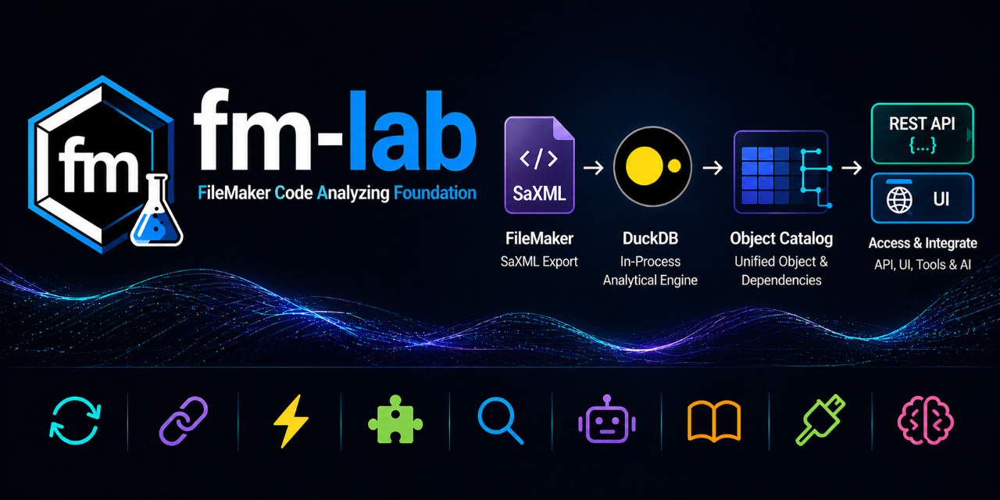
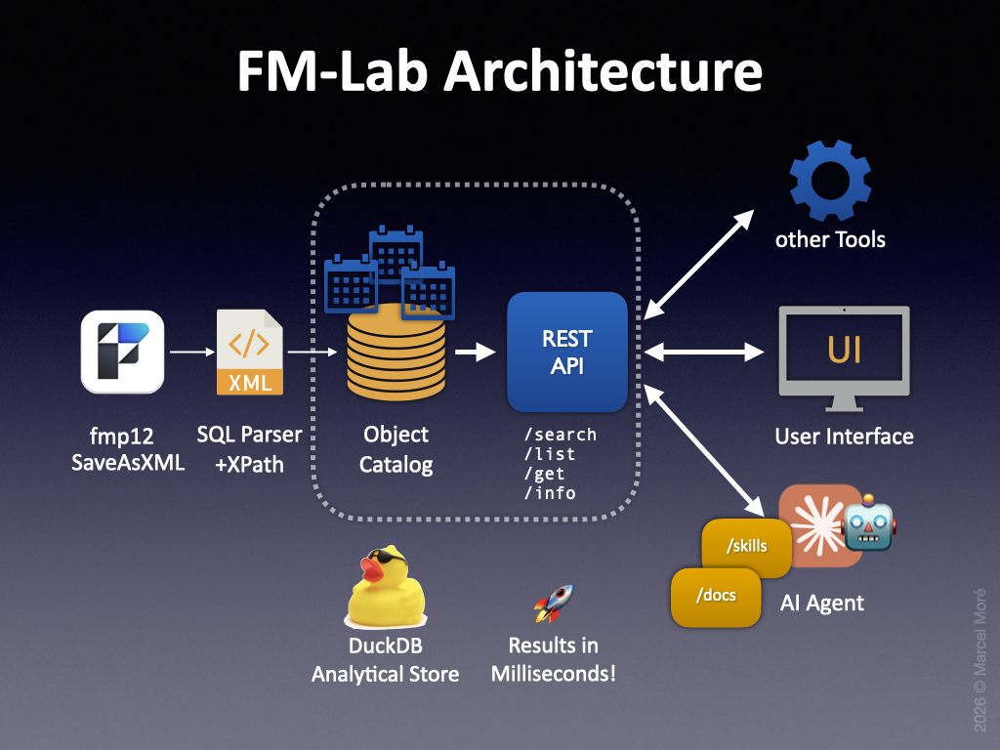

# fm-lab — FileMaker Code Analyzing Foundation

A **DuckDB**-based tool for analyzing **FileMaker SaXML exports**. Converts the XML structure of a FileMaker solution into a queryable DuckDB database — covering all object types and their dependencies — for fast cross-reference analysis.



## Prologue

FileMaker development is facing a new paradigm: **solution structure must be readable and understandable by both humans and AI agents**. While many major programming environments have well-established ecosystems for code analysis, documentation and refactoring, FileMaker's proprietary format makes it hard to participate in that ecosystem — there is no native API to query a solution's structure programmatically.

Several tools try to bridge this gap. Some serve human developer workflows very well, but many are not designed for scalable, agent-driven analysis or open extension. Most are closed source, which limits their adaptability in a rapidly evolving landscape.

This project takes a different approach. It converts the structure of a FileMaker solution — exported as SaXML — into a queryable DuckDB database. The relevant object types (scripts, fields, layouts, relationships, value lists, and more) land in dedicated tables, with **a universal catalog that links objects and their dependencies across the entire solution**. DuckDB's in-process engine makes this catalog fast enough for both interactive queries and **AI-driven analysis at scale**, without any database server setup. A REST API and a web client provide additional access layers for GUI and integration workflows.

The first release focuses on this core: reliable **XML conversion**, a comprehensive **object catalog,** and a modular architecture that is open source and **designed for extension**. Future releases will build on this foundation — the long-term goal is to become a solid developer tooling platform for the FileMaker space.

**Addendum:** [Claris has announced upcoming agentic coding functionality for FileMaker](https://www.claris.com/blog/2026/how-claris-is-building-for-what-comes-next) for the upcoming releases. This does not contradict the goals of this project, but rather emphasizes the need for a solid foundation for code analysis and tooling in the FileMaker ecosystem. The architecture of fm-lab is designed to be flexible and adaptable, so it can integrate with Claris's AI coding features as they evolve, while also providing value to developers who want to leverage AI tools in their workflows today.


## Features

- **XML Ingestion Pipeline** — for FileMaker XML exports into a DuckDB database using a flexible SQL template system, designed for easy maintenance and updates as FileMaker evolves ♻️
- **Detailed Object Catalog** — a set of detailed tables covering the relevant FileMaker object types, with a universal catalog linking objects and their dependencies for fast cross-reference queries 🔗
- **Detailed Reference Catalog** — localized tables for all documented FileMaker script steps and functions, providing reference queries and inline help-docs across up to 11 locales 📄
- **DuckDB Backend** — In-process analytical database engine for fast and flexible queries without server setup, often delivering results in milliseconds, even for large solutions 🚀
- **REST API** — Express server providing HTTP access to the analysis database, enabling integration with external tools and services 🧩
- **Web Client** — React/Vite frontend for interactive exploration of the solution's structure and dependencies with rich visualizations 🔎
- **Claude Skills** — Slash commands for conversion, analysis, and documentation installation, designed for seamless use within the Claude Code environment 🤖
- **Comprehensive Docs** — Easy-to-install documentation of FileMaker Pro and MBS plugin functions 📚
- **Plugin System** — Open architecture for adding new tools and integrations, starting with **[fmIDE](https://github.com/fmIDE/fmIDE)** as a first-class citizen to provide direct navigation into FileMaker's Script Workspace 🛠️
- **Prepared for AI code generation** — The architecture and data model are designed to support AI-driven code generation, augmented by reliable context from the object catalog and the integrated docs 🧠


## [Architecture](docs/fm-lab/Wiki/Architecture.md)

[](docs/fm-lab/Wiki/Architecture.md)

```
SaveAsXML → Parser → DuckDB → REST API ←→ Tools
                                       ←→ UI
                                       ←→ AI Agent
```

## [How it works](docs/fm-lab/Wiki/How%20it%20works.md)

Learn how FM-Lab turns FileMaker XML exports into a structured Object Catalog and uses it as the foundation for analysis, documentation lookup, and agentic workflows. The walkthrough explains the layers of the stack, the flow from ingestion to interaction, and why this architecture is different from simple text-based RAG approaches.


## [Components](docs/fm-lab/Wiki/Components.md)

- **XML (Input)** (`xml/`) — FileMaker XML exports (SaXML) prepared for conversion from your solution.
- **SQL Templates** (`sql/`) — Conversion templates and parser templates for universal catalogs.
- **DuckDB Catalog** (`db/`) — The generated DuckDB database containing the extracted FileMaker objects and their relationships.
- **REST API** (`rest-api/`) — Express server for HTTP access to the analysis database.
- **Web Client** (`apps/web/`) — React/Vite frontend
- **Tools** (`tools/`) — Utility scripts for various tasks.
- **Docs** (`docs/`) — Documentation files for FileMaker Pro and MBS plugin functions, installable via Claude Skills.
- **Claude Skills** (`.claude/skills/`) — Contains Claude Code skills and slash commands for installation, conversion, lookup and analysis.
- **Plugin registry** (`.fmlab/`) — Registry and preferences for FM-Lab plugins.


## Compatibility

At this stage, the tool is ready for **macOS** and **Linux**. A **Windows** version is planned for the future, but may require adjustments to the orchestration scripts setup.

All base technologies (DuckDB, Node.js, Express, React) are cross-platform, so the main work for Windows compatibility will be in adapting the shell scripts and ensuring any file path handling is robust across OSes.

FileMaker XML exports are supported on all platforms where FileMaker Pro is available. The conversion process relies on the structure of the **SaXML** export from **FileMaker Versions 19 and above**. Future updates of FileMaker may require adjustments to the XML parsing.


## Prerequisites for the Analysis Tool (Standalone via GUI or REST API)

- [DuckDB CLI](https://duckdb.org/docs/installation/) ≥ 1.0
- Node.js ≥ 18, npm ≥ 9
- FileMaker Pro (for the SaXML export, SaXML v2.1.0.0+ / FileMaker 19+)

## Prerequisites for Analysis with Claude Code
- [Claude Code](https://docs.claude.com/en/docs/claude-code)
- [duckdb-skills](https://github.com/duckdb/duckdb-skills) plugin for Claude Code (recommended — DuckDB documentation lookup and query assistance)

## Preparing the XML Export

Export your FileMaker solution as XML via `Tools > Save a Copy As XML` (SaXML) in FileMaker Pro. This export contains the full structure of your solution, including scripts, fields, layouts, relationships, value lists, and more — all of which will be parsed and stored in the DuckDB catalog for analysis by FM-Lab. Repeat this for every file of your solution (e.g. if you have multiple files in a multi-file solution). The XML export is the core input for FM-Lab, so it's important to ensure that it is up to date with your current solution structure.

You may want to automate this export process with a script using [Script step: Save a Copy as XML](https://help.claris.com/en/pro-help/content/save-a-copy-as-xml.html) for every file of your solution.

**Important:** Make sure to activate the option "Include details for analysis tools" when saving the XML export, this includes valuable metadata for analysis.

## Setup

```bash
# Clone the repository
git clone https://github.com/marcel-more/fm-lab.git
cd fm-lab
```

Then place all files of your FileMaker XML export in the `xml/` directory and run:

```bash
bash tools/init.sh
```

`init.sh` checks prerequisites, installs dependencies, sets up environment files, converts the XML export, and starts the local Node.js-servers — all in one step. It prints clear instructions if anything is missing.

## Day-to-day

Once `init.sh` has run successfully, start both servers with:

```bash
bash tools/start-servers.sh
```

### Manual start (power users)

For custom setups — e.g. running the REST API as a standalone service:

```bash
# REST API (port 3003)
cd rest-api
cp .env.example .env   # adjust ports if needed
npm run dev

# Web Client (port 5173)
cd apps/web
cp .env.example .env   # adjust VITE_API_URL if API runs on a different port
npm run dev
```

## Further Documentation

- [`Documentation.md`](docs/fm-lab/Documentation.md) — Full project documentation (work in progress)
- [`CLAUDE.md`](CLAUDE.md) — includes documentation on tables, columns, and query patterns
- [`CHANGELOG.md`](CHANGELOG.md) — release history

## Optional Reference Data

Test data and tools for fm-lab developers are available for validation (will be downloaded from their source repositories by Claude skills on demand):

```bash
# ooe-fm — "One Of Everything" FileMaker reference database (XML parser test data)
#   /install-ooe-fm

# fm-xml-export-exploder — Rust tool for splitting FileMaker XML exports
#   /install-fm-xml-export-exploder
```

## Status

**v0.6.1** — First public release with core XML conversion, DuckDB catalog, REST API, and web client for exploration.

Some rough edges, but the core architecture is in place and ready for real-world use and feedback. Future updates will focus on stability, UI optimizations, and expanding the feature set.

**v0.6.2** to **v0.6.7** — Optimizations for XML-Parser, REST-API and web client.

Further improvements to the foundation of the project to lay the groundwork for upcoming features. Web client now supports more detailed exploration of the object catalog and dependencies.

**Note:** `CLAUDE.md` and the Claude Skills are currently in German. An English version is planned for the next release.

Many more features are under current development... stay tuned for updates! 😎

## Roadmap

- Windows support
- Snapshots (for tracking changes over time)
- Multi-Solution support (for analyzing multiple files from different solutions together)
- Deep integration with other tools for optimal support of different developer workflows (VS Code, Raycast, Obsidian, etc.)
- Support for other AI agents besides Claude Code (Agents.md, Skills)
- AI-driven code generation and refactoring tools based on the object catalog and integrated documentation

## Vision

*One interface to rule them all — in your personal style of workflow:*

- Your FileMaker Solution
- Your Favorite Tools
- Your Agent
- Your Project Docs
- All FileMaker-related docs and knowledge
- All possible extensions
- All in one Interface


## Fine Print

### AI-assisted development

This project was developed with significant support from AI-assisted development workflows, including Claude Code.

Spec-driven development with AI agents is used as a best practice together with human oversight and decision-making to ensure that the project remains aligned with its goals and maintains a clean architecture.

All changes were reviewed, selected, and integrated by the project maintainer.

### Disclaimer

This software is provided "as is", without warranty of any kind, express or implied. No guarantees are made regarding completeness, functionality, or stability. The authors accept no liability for data loss or unintended interactions with the user's environment. Use at your own risk.

### License

MIT — see [`LICENSE`](LICENSE).
