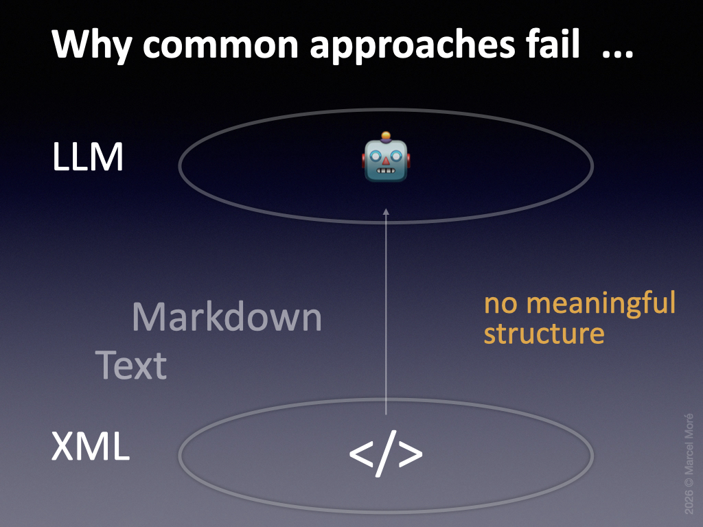
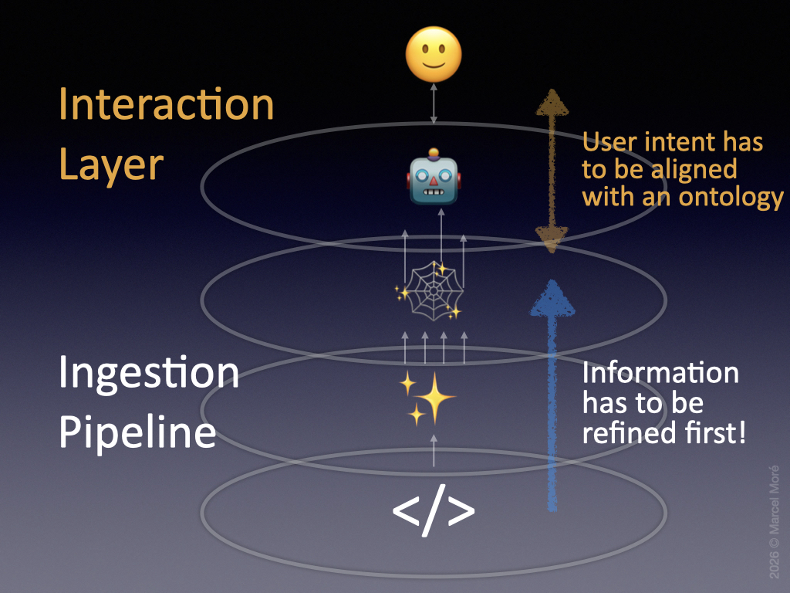
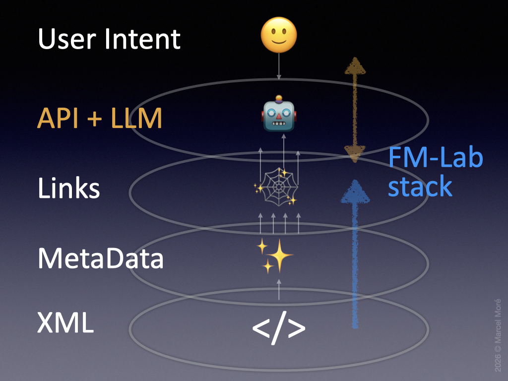
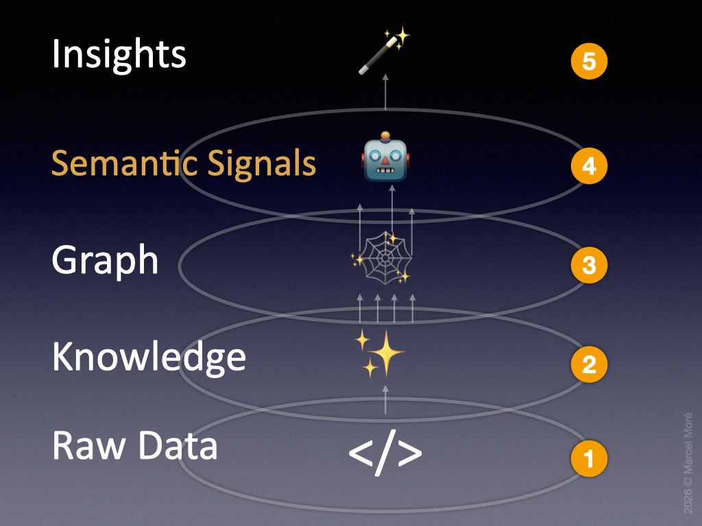

# How it works

- [Why common approaches fail](#why-common-approaches-fail)
- [What to solve first](#what-to-solve-first)
- [How the FM-Lab stack is approaching that task](#how-the-fm-lab-stack-is-approaching-that-task)
- [A foundation for agentic coding in FileMaker](#a-foundation-for-agentic-coding-in-filemaker)
- [How it maps to the technical components](#how-it-maps-to-the-technical-components)

## Why common approaches fail

Many developers have already tried to put an LLM on top of FileMaker to make agentic coding work – so did I in the first place. If you have tried it yourself, you would notice that the obvious approach is quite limited and fails early.

Typical problems are:
- slow iteration speed in agentic dialog
- high token consumption
- lack of understanding FileMaker's syntax and grammar
- lack of understanding technical structure of your solution
- lack of understanding business meaning of your solution
- hallucinations

You might expect that all relevant information about your FileMaker solution is already included in the SaXML export. This is true in theory. In practice, however, the XML is not organized in a task-oriented way that an LLM can efficiently use for analysis or coding. This remains true if you strip away the XML syntax to provide clean text or markdown to make it more readable for the language model.

So we definitely need a more sophisticated approach to solve this problem.

---

## What to solve first

To make an agentic approach work, we have to distinguish two separate tasks first:
1. Refine the information into a meaningful structure.
2. Align the user intent to that underlying structure (ontology) for the agent to understand what to do.

### Ingestion Pipeline
A **conversion process** is needed to transform the raw FileMaker XML into addressable **objects**, extracted metadata and explicit **relationships**. We can treat the result as a lightweight **knowledge graph** based on an **ontology**.

### Interaction Layer
A set of **skills**, **templates** and **references** is needed to make the typical **developer workflow** understandable to the LLM and establish reliable boundaries for the included interactions.

---

## How the FM-Lab stack is approaching that task

If you think of the given pieces of the puzzle, some implicit components are already present in our setup. They just have to be refined and put into the right places. FM-Lab divides the stack into **5 core layers** that build upon each other.

### Layer 1 – XML

This represents the raw data that we get from **FileMaker's SaXML export**. All information about the structure and naming of the solution is contained in XML catalogs with a distinct structure on its own.

The format of the XML data is not obvious to our use case but has its own semantic meaning within the context of Claris' internal rules of representing a FileMaker solution. So we need to understand what parts of it are valuable for us and how to read them.

### Layer 2 – Metadata

Once we understand the bits and pieces of the XML data, we can extract the metadata of the objects inside the FileMaker solution. This metadata needs to be represented in its own format, better suited for analysis and querying. FM-Lab therefore defines a **generic object format** and stores all elements in a **unified catalog**.

### Layer 3 – Links

Once we have a generic object format, unique IDs and proper **object types**, we can extract the **relationships** from the XML. These relationships can be explicit or implicit. FM-Lab stores them in a second unified format that represents the links between objects. This is the **technical layer** of our **knowledge graph**.

This can then be complemented by the docs of the FileMaker development environment to provide the LLM knowledge about the internal rules and behavior, for example of script steps and calculations. This reduces hallucinations, even though modern frontier models have become noticeably better at FileMaker-related reasoning compared to earlier generations.

Luckily, parts of the **semantic layer** are already present inside the FileMaker solution itself. Script names, variable names, schema definitions, comments and naming conventions all provide semantic signals for the LLM. This layer is not perfect and depends heavily on development discipline. But even imperfect signals become useful when combined with structural metadata.

### Layer 4 – API + LLM

To build a [clean architecture](Architecture.md) we separate our catalogs from their consumers with the help of a proper API. FM-Lab provides an internal **REST API server** based on a template system for typical queries on our **object catalog**. So we can 
- easily extend our patterns to retrieve information.
- present our interface to different consumers.
- define clear boundaries between ingestion pipeline and interaction layer.
- be ready for a client-server model if the setup grows.

If you think of it, an LLM is just one possible consumer in a range of different use cases. Putting it on top of an API gives us clean boundaries. But to our surprise it turns out that modern agents (like Claude Opus or OpenAI Codex) are powerful enough to **work directly against the object stores database and build queries on the fly**. To not limit them we will allow direct **CLI access** for the agents in our setup as an alternative route to access the object catalog. The API is the safe and stable path. Direct database access is the expert path for agents that are able to explore the catalog dynamically.

Besides the agent access layer the API also allows us to map specific objects to specific documentation about the object type, structure and intended use to enrich the semantic meaning.

### Layer 5 – Intent mapping

When the user asks about a specific object or relation, the agent can query the database and fetch related information and knowledge accordingly. It only needs to know, which information is in reach, how it is structured and how to reach it. If we also instruct the agent to fetch associated documentation alongside the object data, it is easier for him to understand what the nature of the technical aspects in your solution is all about.

LLMs already bring a lot of knowledge to the table when it comes to software development and related patterns anyway. So it's only a small gap to map this domain knowledge to the structure and specifics of a FileMaker-flavored tech stack.

But what about your specific solution that is baked inside the technical structure of the app? Any business solution can be different and when you want insights about the business rules and the semantic aspects of what you built in code, there are far more things to take into consideration than the code alone.

At this point we need an interaction layer to instruct the agent on how to combine all available information and put the world knowledge of the LLM on top of it. As we discovered in the previous sections about the knowledge graph and semantic signals there is already far more at hand, than the structural elements of the code itself. So we could give our agent some skills on how to investigate your solution and draw conclusions about its meaning. We will dive deeper into the strategies behind it in the next chapter when it comes to [agentic workflows](Workflow.md).

---

## A foundation for agentic coding in FileMaker

The result is a foundation that allows an agent to investigate a FileMaker solution in an iterative loop. Instead of manually browsing metadata, the agent can follow relationships, retrieve documentation, inspect naming patterns and combine these signals into a coherent understanding of the solution. This makes agentic analysis much faster and broader than the classical way of inspecting FileMaker metadata by hand.

### Agentic analytics

It turns out that the refinement of the raw data into knowledge in combination with the right semantic signals and some boundaries and rules on how to bring this in perspective is a really powerful strategy to extract insights from the heart of a FileMaker solution.

In early experiments with Claude Opus the agent was able to abstract and reason about the solution and the included business rules on a very high level with the ability to go really in-depth to understand all critical nuances when answering questions and respond to tasks.

This ability is extremely valuable when it comes to understanding huge legacy solutions that were built with FileMaker for decades. Often documentation is not complete or missing at all, or the person who built the solution in the first place is no longer available to answer questions about it. In the best cases, using agentic analytics with FM-Lab feels less like searching through metadata and more like asking a senior developer who already understands the structure of the solution in every little detail! So finally we have a tool at hand, that is capable of helping us to understand and fix technical debt at scale and is just available to answer any question instantly without having us to spend significant time on research first.

### Agentic coding

It is even more valuable if we want the agent to write new code inside an existing FileMaker solution. Because coding FileMaker is not only about writing code in the right language style and proper format. A main part of it, is also to apply solid coding approaches on your existing solution without breaking existing conventions, standards, architecture or functionality.

Now the agent already has a deep understanding of all critical aspects:
- the technical foundation about FileMaker scripts and functions
- the structure and information about all included technical objects
- the semantic layer on what business case or solution patterns are solved inside your code
- additional documentation about your application or your plans (as an extra layer to clarify intent)

The agent can then apply its own knowledge about:
- best practices in architecture and coding patterns
- best practices in maintenance and refactoring
- best practices in project management
- specific domain knowledge that applies to your use case
- writing and extending documentation

With this foundation in place, the agent can do useful work because modern coding agents are good at:
- solving specifications of a given task
- validating their own success against specific criteria
- following the agentic loop until definition of done

Think of it as a well-balanced package of:
- prompt engineering (data, knowledge, skills)
- harness engineering (boundaries, structures, loops)
- access to tools (databases, web-research, instant-coding inside the harness)
- optional memory layer on top to make it even more sophisticated

### Foundation

FM-Lab is intended to provide a foundation for agentic analysis and agentic coding in the FileMaker space. It gives you a prepackaged infrastructure with object catalogs, relationship extraction, documentation references, API access, templates and skills as a solid starting point.

At this early stage, the public repo is focused on agentic analysis. It contains the underlying infrastructure, battle-tested templates and skills, and helper tools to install official documentation alongside your extracted solution metadata.

A second stage for complete agentic coding is already used internally and will be published later with additional skills, documentation and a more controlled coding harness. In the meantime, you can build your own coding harness on top of FM-Lab or adapt the described strategies to your specific needs.

All given skills and templates can be customized. The more specific your setup is, the better the results can become for your use case.

### Limitations

FM-Lab does not magically understand every FileMaker solution. The quality of the analysis depends on the available XML export, the completeness of the extracted relationships, naming conventions, comments and additional documentation.

Agentic analysis can reveal structure, dependencies and likely business meaning, but its conclusions still need human review. This is especially important when the solution contains inconsistent naming, hidden business rules, incomplete documentation or legacy patterns that are only understandable through operational context.

Agentic coding needs even stricter boundaries. Generated changes should be validated, reviewed and executed inside a controlled harness before they are applied to a real FileMaker solution.

---

## How it maps to the technical components

As we have seen in the previous section, all elements from the different layers stack up in a very logical way to make sense for our use case. And even offer a foundation to extend further in agentic coding and building a project-specific memory layer.

Here is the mapping to the technical components of FM-Lab to give you a better understanding how and where every single step is processed.

| Layer  | Description                                  | Tool                                                                                  | Source                                                                                                                                                          |
| ------ | -------------------------------------------- | ------------------------------------------------------------------------------------- | --------------------------------------------------------------------------------------------------------------------------------------------------------------- |
| **1**  | XML sources                                  | **FileMaker**  SaXML export                                                        | `xml/`                                                                                                                                                          |
| **2**  | Object catalog                               | **Batch script** (Shell) **DuckDB** SQL-Template                                | `tools/convert_fm_xml.sh` `sql/convert_xml.sql` `db/fm_catalog.duckdb`                                                                                    |
| **3**  | Knowledge graph                              | **DuckDB** SQL-Templates                                                           | `sql/create_universal_catalogs.sql` `sql/create_variables_catalog.sql`                                                                                       |
| **4**  | Templates + Docs                             | **Node.js REST API** **DuckDB** SQL-Templates References (DB) Docs (HTML) | `sql/sample_queries.sql` `rest-api/templates/` `rest-api/db/fm_catalog.duckdb` `rest-api/db/fm_reference.duckdb` `docs/claris-help/` `docs/mbs/` |
| **5**  | Skills + Workflow                            | **Claude Code** System prompt Skills                                            | `claude.md` `.claude/skills/fm-analyze` `.claude/skills/fm-summarize`                                                                                     |
| Output | Generated scripts / analysis / documentation | **Claude Code**                                                                       | `output/` `scripts/`                                                                                                                                         |

> Refer to [Components](Components.md) for a more in-depth view of the repo structure.