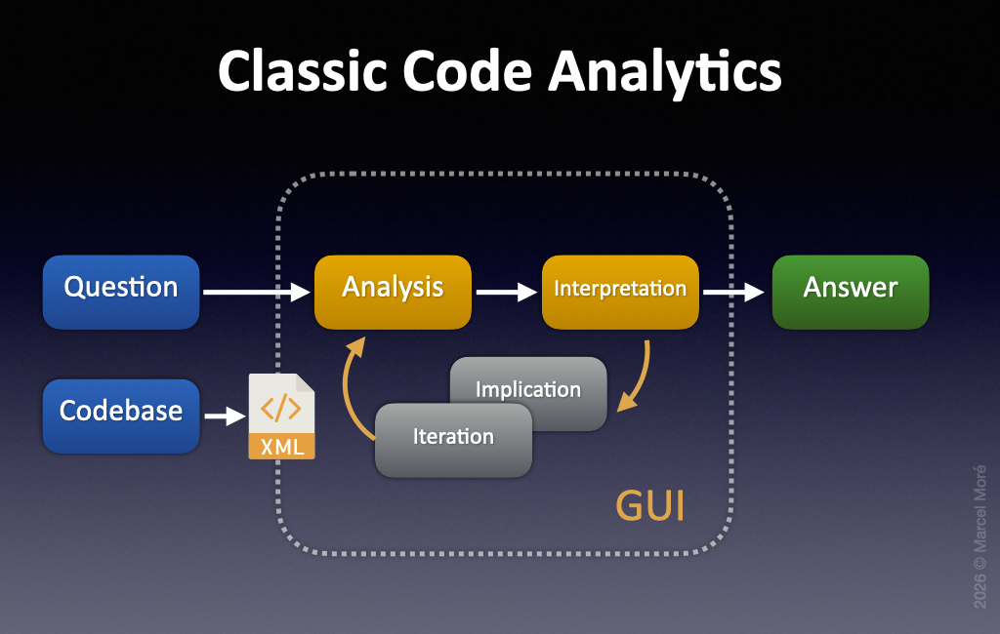
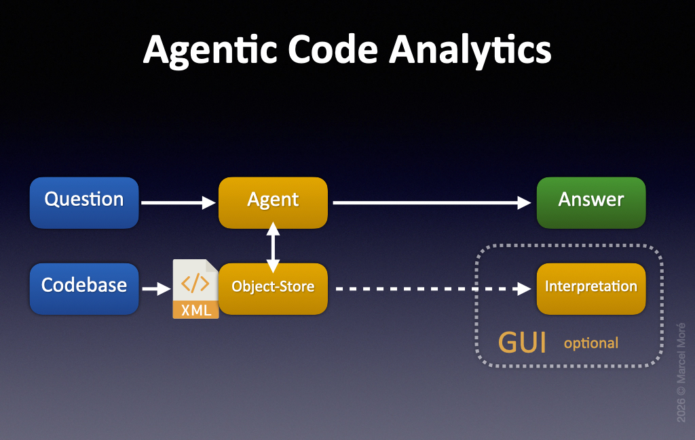

# Workflow

- [Classic Code Analytics](#classic-code-analytics)
- [Agentic Code Analytics](#agentic-code-analytics)

To understand the new type of workflow that FM-Lab supports, it is crucial to distinguish traditional patterns from the new approach.

---

### Classic Code Analytics

When it comes to FileMaker, the classic way of doing code analysis depends on loading your XML export into some kind of tool and then using a graphical user interface (GUI) to explore the included structure.

You would then click and navigate between different types of objects, read and understand the implications and iterate until you can answer your question. Some tools provide additional reports and routines to check for errors, orphaned objects or other inconsistencies. More advanced tools provide workflow, project management, Git support and deployment pipelines.

The value of classic code analytics tools lies in the accumulated knowledge of many years of well-thought-out developer workflows. They reflect practical feedback from tool users and encode many common analysis patterns.

The downside is the limited flexibility when it comes to new questions that are not covered by the tool. Another pain point is scalability. Large FileMaker solutions can overwhelm both the underlying infrastructure and the developer who has to keep many relationships, dependencies and naming patterns in mind.

---

### Agentic Code Analytics

Agentic code analysis takes a very different approach. You ask your question in plain English (with or without relevant anchors to the solution at hand). The AI Agent will then find and collect all relevant information and tries to draw its own conclusion that it will provide to you as an answer. You can then continue the conversation with your agent to dig deeper and refine the answer.

The agent does not replace the underlying metadata. It changes the way you interact with it.

If the answer is good enough for the task at hand, you may not need to inspect the underlying code and metadata manually. You can continue with your actual task instead.

The better the agent is at understanding your solution, the quicker you get an answer to your question. Even high-level understanding and semantic answers about included business logic are now within reach. That can save a lot of time!

Manual exploration inside the codebase becomes optional, but review and validation remain important.